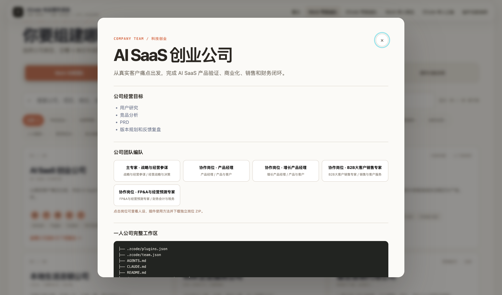

# ZCode 中文专家操作系统

面向中文用户的 **Work 专家团队 × ZCode 工程团队 × 插件图鉴**。页面把岗位、公司团队、工程项目、专家工作区和 273 个真实插件整合在同一套导航中。

## 在线访问

### <https://zhangsugang.github.io/zcode-plugin-guide/>

直接把链接发给别人，浏览器打开即可使用；页面无远程脚本和字体，也可下载后离线运行。

## 核心内容

- **Work 专家团队**：20 种公司化团队，每家公司配置 1 位主专家和 4 位协作岗位。
- **ZCode 专家团队**：20 种常见开发项目，绑定架构、实现、测试、安全和发布专家。
- **100 个 Work 单人岗位**：覆盖经营、产品、品牌、电商、销售、财务、税务、法务、投行、人力、供应链、项目和企业办公。
- **100 个 ZCode 工程专家**：覆盖架构、语言运行时、前后端、数据平台、云与 SRE、测试、安全、AI 和工程效率。
- **273 个插件中文图鉴**：中文名称、准确英文安装名、功能说明、使用场景、推荐星级、使用门槛和操作方法。
- **完整 ZIP 工作区**：
  - 公司团队可下载包含 5 个岗位的“一人公司”整包。
  - 每个 Work/ZCode 岗位均可独立下载。
  - 包含 `AGENTS.md`、`CLAUDE.md`、`.zcode/agents/`、插件配置、流程、记忆文档、SQLite schema 和交付模板。
- **统一五入口导航**：Work 专家团队、ZCode 专家团队、Work 单人岗位、ZCode 单人工程、插件功能说明。
- 支持公司、项目、岗位、能力、插件中英文名搜索和分类筛选。
- 支持 `#work/...`、`#codex/...`、`#expert/...`、`#plugin/...` 深链接。
- ZIP 在浏览器本地即时生成，不上传输入，不包含密钥、Cookie、`.env` 或个人数据。

## 使用方法

1. 打开在线页面。
2. 从顶部导航选择团队模式或单人专家模式。
3. 搜索公司、项目、法律、财务、投行、架构、前端、安全等目标。
4. 点击卡片查看专家编队、专业过程、插件功能和使用方法。
5. 下载公司团队 ZIP 或独立岗位 ZIP，在 ZCode 中直接以该文件夹作为工作区使用。
6. 在插件功能说明中用准确英文名回到 ZCode 插件页搜索安装。

## 离线使用

下载仓库中的 [`index.html`](./index.html)，双击即可使用，不需要服务器或构建环境。

## 预览

### 专家操作系统首页

### 公司团队详情

## 研究与能力边界

岗位流程参考公开职业资料和公开 GitHub Agent 项目，并采用原创、可维护的人设与路由规则。页面不提取第三方不可见系统提示词、内部配置或凭据。插件能力以公开说明为准；涉及账号、外部发布、资金、生产数据或高影响操作时应人工复核。

## License

MIT
